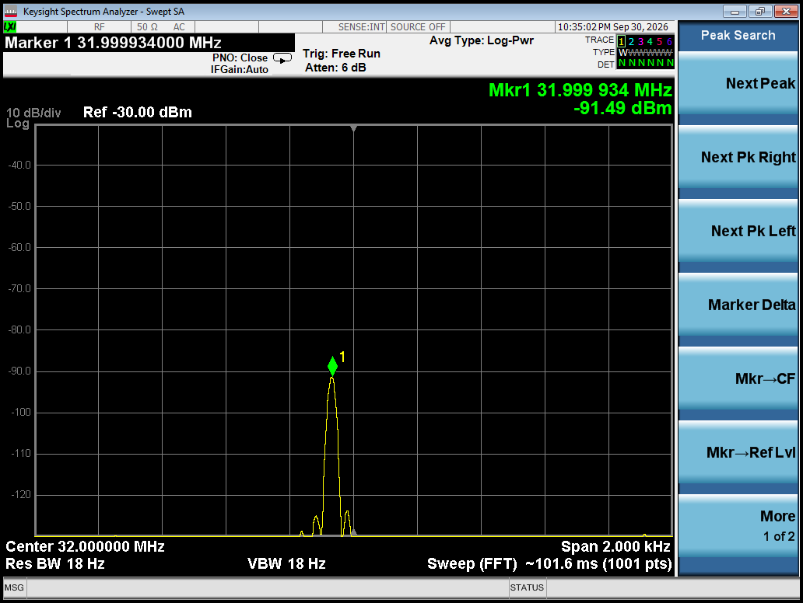
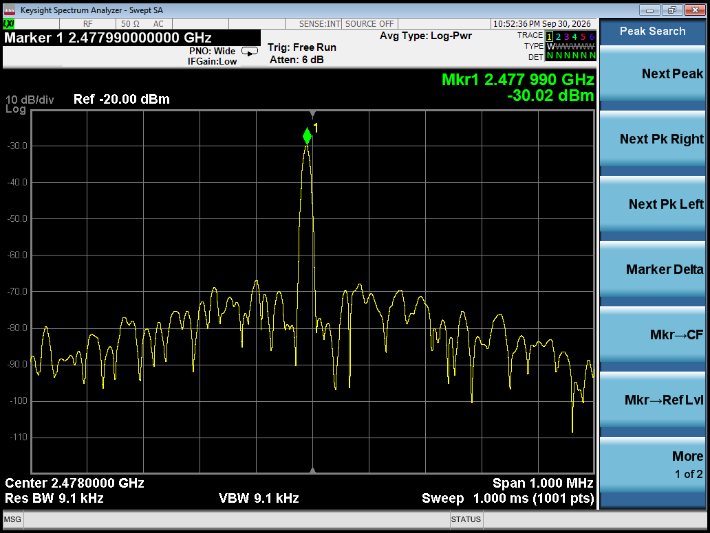
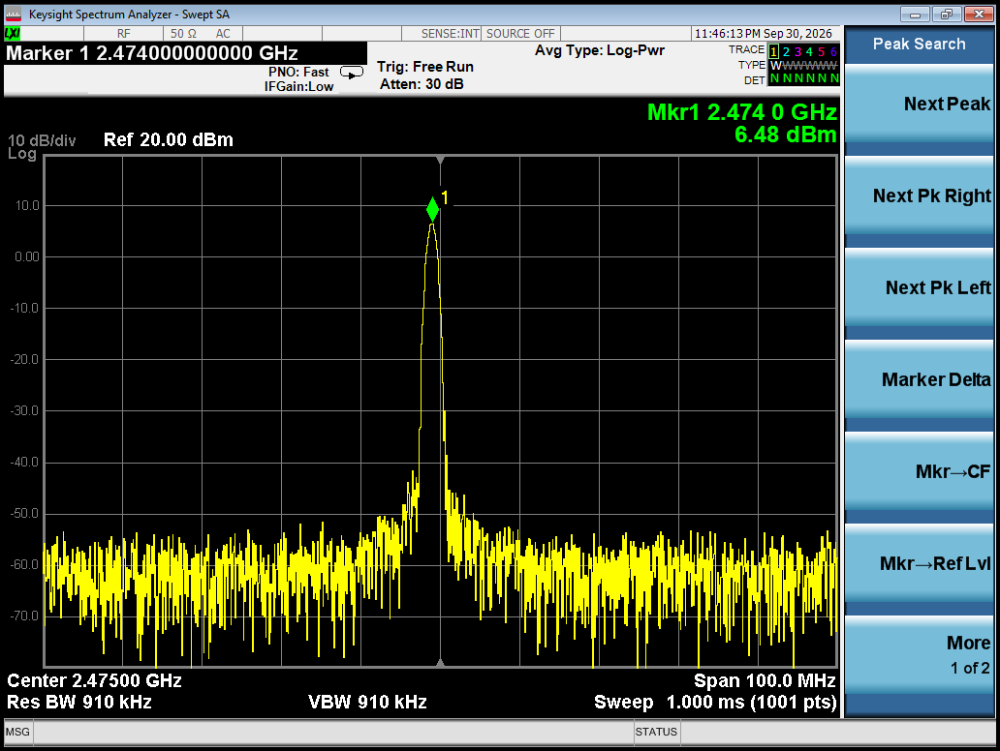
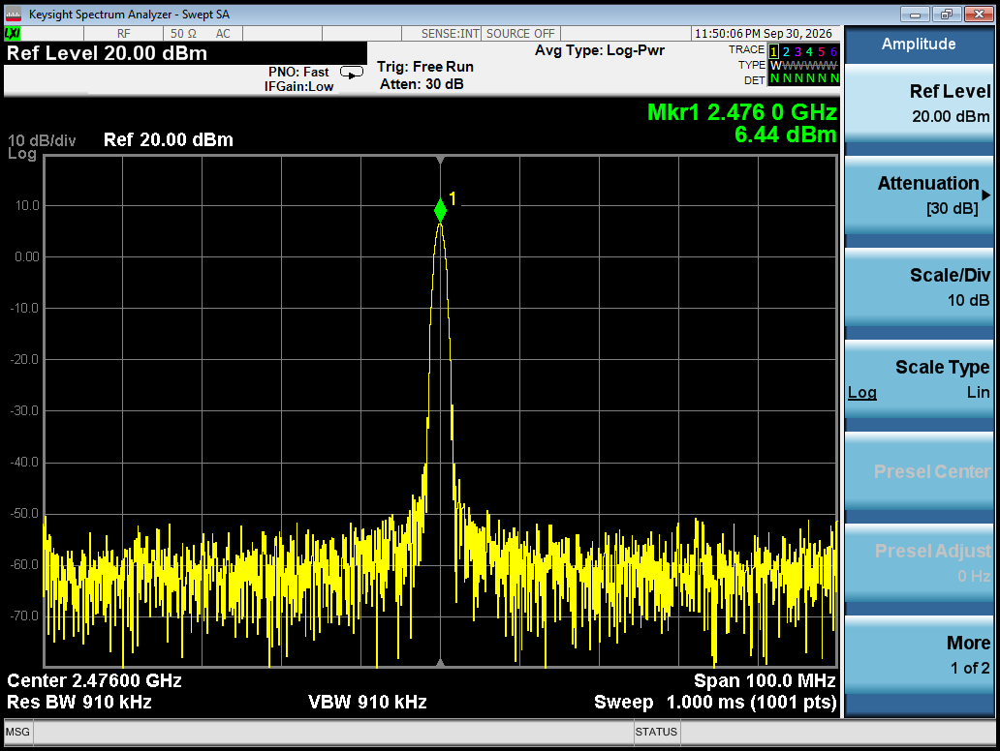
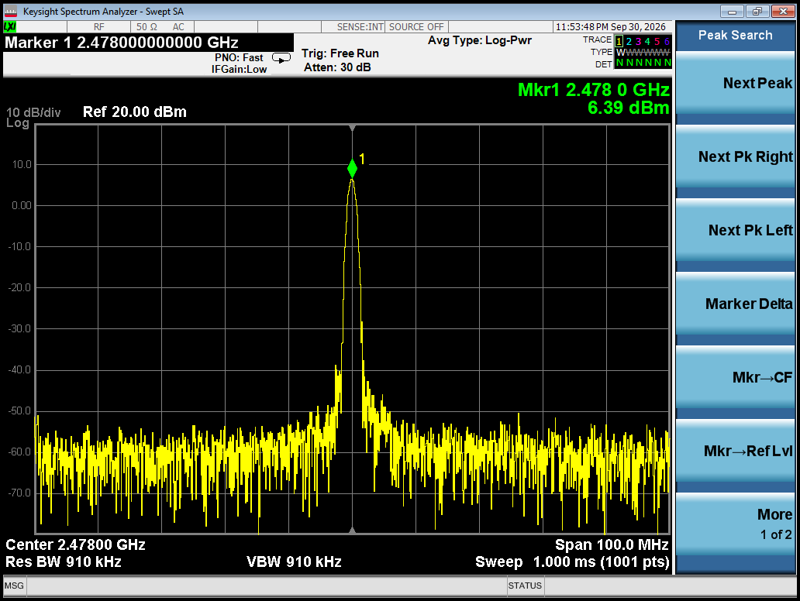

# 应用频段射频测试报告

> **目的**：验证应用频段 **2474 / 2476 / 2478 MHz**（`RF_Uart/APP/include/rf.h` 里的
> `CH_HOP_TBL = {74, 76, 78}`，按 `f = 2400 + ch`）的**发射性能是否正常**，
> 重点看频偏与三个频点的功率一致性（尤其 2478 MHz 靠近 2.4G 上限 2483.5 MHz，是否有滚降）。
>
> **结论：通过** —— 三个候选信道都可用，`CH_HOP_TBL` 无需调整。
>
> 本报告数据**以频谱仪截图为原始记录**（截图见 [`images/`](images/)）。

---

## 一、被测对象

| 项 | 值 |
|---|---|
| 芯片 | CH570Q（RISC-V，2.4G 私有协议，2M PHY） |
| 固件 | `RF_TEST`（定频发射；上电即发，内部走 `RFIP_SingleChannel()`） |
| 发射功率档 | `p 7` = **+7 dBm**（`LL_TX_POWEER_7_DBM`，芯片最高档） |
| 晶振 | 外部 32 MHz；负载电容 = 片内 `HSECap_6p` + 外部 4.7 pF × 2 |
| 晶振频偏（基准） | **31.999934 MHz = −2.06 ppm**（见 [3.1](#31-晶振频偏基准) 与截图） |

频点与固件对应关系（定频接口 `RFIP_SingleChannel(ch)` 按 `f = 2402 + 2×ch`）：

| 应用信道（`rf.h`） | 频率 | 定频信道 | 固件 |
|---|---|---|---|
| 74 | 2474 MHz | 36 | `RF_TEST_2474M_ch36.hex` |
| 76 | 2476 MHz | 37 | `RF_TEST_2476M_ch37.hex` |
| 78 | 2478 MHz | 38 | `RF_TEST_2478M_ch38.hex` |

---

## 二、测试条件

| 项 | 值 |
|---|---|
| 仪器 | **Keysight Spectrum Analyzer（Swept SA）**，AC 耦合 / 50 Ω |
| 耦合方式 | **两种口径**（见下表）：晶振频偏与载波频率用**耦合**（近场/天线耦合），发射功率用**焊接同轴电缆传导** |
| 外部衰减器 | 无（均使用仪器内部衰减） |
| 环境温度 | 常温（未记录具体值） |
| 仪器时间戳 | 截图显示 Sep 30, 2026（该机 RTC 未校准，不作为测试日期） |

三组测试各自的设置与耦合方式（均取自截图）：

| 测试组 | 中心频率 | Span | RBW / VBW | Ref Level | Atten | 耦合方式 | 对应截图 |
|---|---|---|---|---|---|---|---|
| 晶振频偏 | 32.000 MHz | 2 kHz | 18 Hz | −30 dBm | 6 dB | **耦合** | `xtal-32MHz-frequency-deviation.png` |
| 载波频率 | 2474 / 2476 / 2478 MHz | 1 MHz | 9.1 kHz | −20 dBm | 6 dB | **耦合** | `*-frequency-offset.png` |
| 发射功率 | 2476 MHz | 100 MHz | 910 kHz | 20 dBm | 30 dB | **焊接传导** | `*-transmission-power.png` |

> ⚠️ **两种口径的绝对值不可直接比较**：耦合测量的读数里含几十 dB 的未知耦合损耗，
> 所以频率组读数（−30 ~ −37 dBm）远低于功率组（+6.5 dBm）属**正常现象**，
> 不代表任何一方有问题。频率只取**频率值**、功率只取**功率值**，各自结论均成立。

### 2.1 ⚠️ 接法踩坑记录（**功率测试阶段**，复现时务必先看）

功率测试采用焊接同轴电缆的传导方式，首次测得 **−37.56 dBm**（比预期低约 43 dB），
原因有两个，都已修正：

| 坑 | 现象 | 修正 |
|---|---|---|
| **焊在 Π 型匹配网络的"接地点"上** | 测到的是**地线传导的泄露/共模信号**，幅度极低但频率正确、断电即消失（很容易误判为"发射功率不足"） | 改焊到**靠天线一侧的【信号焊盘】**（非地端） |
| **天线未断开** | 功率被分流进天线，且两者并联造成失配 —— **不仅绝对值失真，三个频点的相对差值也会失真**（天线阻抗随频率变化） | **割断/拆除天线**，让射频输出只接电缆 |

修正后读数回到 **+6.5 dBm**，与 `+7 dBm` 档减去约 0.5 dB 电缆损耗吻合 ✅。

> 另一条经验：**不要空载发射**（拆了天线必须接 50Ω 负载或电缆）。

---

## 三、测试结果

### 3.1 晶振频偏（基准）

| 项 | 值 |
|---|---|
| 标称 | 32.000000 MHz |
| 实测 | **31.999934 MHz** |
| 偏差 | −66 Hz = **−2.06 ppm** |
| 耦合方式 | 耦合（该组设置：Span 2 kHz / RBW 18 Hz / Ref −30 dBm / Atten 6 dB） |



> 说明：这是载波频偏的**基准**——RF 载波由该晶振倍频，两者 ppm 应当一致。
> 早前另一次测量记录为 31.999954 MHz（−1.44 ppm），与本次相差 20 Hz（0.6 ppm），
> 属于读数重复性范围。

### 3.2 载波频率

| 应用信道 | 标称频点 | 实测频率 | 偏差 | 偏差 (ppm) |
|---|---|---|---|---|
| 74 | 2474 MHz | **2473.986 MHz** | −14 kHz | **−5.7** |
| 76 | 2476 MHz | **2475.992 MHz** | −8 kHz | **−3.2** |
| 78 | 2478 MHz | **2477.990 MHz** | −10 kHz | **−4.0** |

**三点全部满足 ±10 ppm 目标**，最大绝对偏差 14 kHz（仅占 2 MHz 信道宽度的 0.7%）。

| 2474 MHz | 2476 MHz | 2478 MHz |
|---|---|---|
|  |  |  |

> **测量说明**
> 1. 标称频点按 `f = 2402 + 2×ch` 计算。该接口的信道编号已由实测确认为**线性**
>    （ch36 → 2474 MHz 附近），与 `rf.h` 的 `{74,76,78}` 换算一致。
> 2. **本组用耦合方式测量**：三张截图的峰值功率为 −37.00 / −32.60 / −30.02 dBm，
>    比功率组（焊接传导）的 +6.5 dBm 低约 40 dB，这正是**耦合损耗**（几十 dB）所致，
>    属正常现象。频率读数由载波本身决定、**与耦合路径无关**，故数据有效。
> 3. 读数分辨率受 RBW（9.1 kHz）限制，ppm 级偏差里仍含少量仪器不确定度；DUT 真实频偏
>    以晶振测量（−2.06 ppm）为基准参考。

### 3.3 发射功率（焊接传导，峰值功率）

| 应用信道 | 频点 | 峰值功率 | 相对 2474 MHz |
|---|---|---|---|
| 74 | 2474 MHz | **+6.48 dBm** | 基准 |
| 76 | 2476 MHz | **+6.44 dBm** | −0.04 dB |
| 78 | 2478 MHz | **+6.39 dBm** | **−0.09 dB** |

- 三点**最大差异仅 0.09 dB**，功率一致性极好；
- **2478 MHz（离 2.4G 上限 2483.5 MHz 只剩 5.5 MHz）几乎没有滚降** ✅（仅 −0.09 dB）；
- 绝对值 +6.4 dBm 量级与 `+7 dBm` 档吻合（差值来自电缆损耗与芯片档位公差）。

| 2474 MHz | 2476 MHz | 2478 MHz |
|---|---|---|
|  |  |  |

### 3.4 频谱形状

三张功率截图中的谱形均为**单根窄谱线**（无调制展宽）→ 说明
`RFIP_SingleChannel()` 发射的是**未调制载波（CW）**。

这对本次测试是有利的：峰值即为载波功率与载波频率，无需做信道功率积分。

---

## 四、结论

### 4.1 载波频率 ✅

- 三点偏差 **−3.2 ~ −5.7 ppm**，**满足 ±10 ppm 目标**；
- 绝对偏差 ≤14 kHz，占 2 MHz 信道宽度 **0.7%**，**远小于 2M PHY 解调容限**；
- 主机与从机同板同固件、频偏**同向**，**相对频差接近 0**；
- 2478 MHz 与另两点一致，靠近 2.4G 上限时频率合成无异常。

### 4.2 发射功率 ✅

- 三点 **+6.48 / +6.44 / +6.39 dBm**，**最大差异 0.09 dB**；
- **边缘频点 2478 MHz 几乎无滚降**，匹配与滤波在整段应用频段内表现一致。

### 4.3 总体判定

> **应用频段 2474 / 2476 / 2478 MHz 的发射性能正常。`CH_HOP_TBL = {74, 76, 78}` 三个
> 候选频点都可以使用，无需调整频点表。**

依据：频率三点均满足 ±10 ppm（最差 −5.7 ppm）、功率三点离散仅 0.09 dB，且**最靠近频段
边缘的 78 既没有频率异常也没有功率滚降**。

### 4.4 未覆盖项（后续如需可补）

- **接收侧未测**：本次只测发射（定频固件只有发射），**接收灵敏度 / 丢包率未测**；
  如需完整评估该频段，需要双机链路测试固件（连续对打 + 收包统计）；
- 环境温度未记录；
- 两种耦合口径（耦合 / 焊接传导）的**绝对幅度**不可互比，本报告只取各自的
  频率值与功率值，未做跨口径换算。

---

## 五、复现步骤

```bash
# 1) 编译
cd RF_TEST && cmake -B build -G "Unix Makefiles" && cmake --build build -j"$(nproc)"

# 2) 烧对应频点的 hex 到 CH570Q 板
#    2474 MHz -> RF_TEST_2474M_ch36.hex
#    2476 MHz -> RF_TEST_2476M_ch37.hex
#    2478 MHz -> RF_TEST_2478M_ch38.hex

# 3) 上电：LED 先闪 N 次提示频点（1/2/3 = 2474/2476/2478），随后常亮 = 正在发射
# 4) 频谱仪读峰值频率与功率（设置见第二节表格）
```

**测功率时的接法（关键）**：拆除天线 → 在**靠天线一侧的信号焊盘**（非地端）焊同轴电缆
芯线、屏蔽层就近接地 →（建议串 10 dB 衰减器）→ 频谱仪。**绝不能空载发射**。
测频率可用耦合方式，读数里的耦合损耗不影响频率。

> 用法细节（接线、命令、两个坑）见 [`../RF_TEST/README.md`](../RF_TEST/README.md)。
